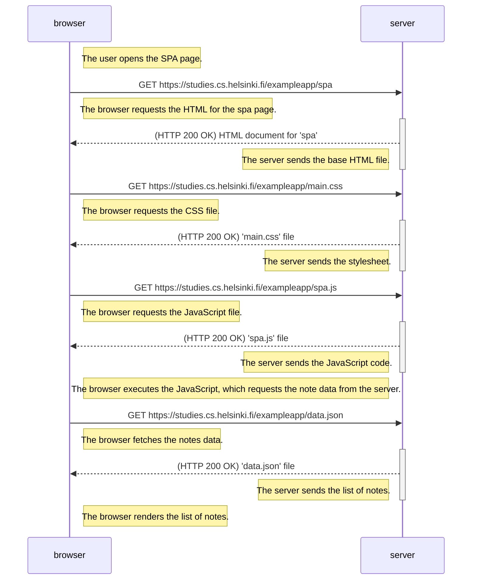

```mermaid
sequenceDiagram
    participant browser
    participant server

    Note right of browser: The user opens the SPA page.

    browser->>server: GET https://studies.cs.helsinki.fi/exampleapp/spa
    Note right of browser: The browser requests the HTML for the spa page.

    activate server
    server-->>browser: (HTTP 200 OK) HTML document for 'spa'
    Note left of server: The server sends the base HTML file.
    deactivate server

    browser->>server: GET https://studies.cs.helsinki.fi/exampleapp/main.css
    Note right of browser: The browser requests the CSS file.

    activate server
    server-->>browser: (HTTP 200 OK) 'main.css' file
    Note left of server: The server sends the stylesheet.
    deactivate server

    browser->>server: GET https://studies.cs.helsinki.fi/exampleapp/spa.js
    Note right of browser: The browser requests the JavaScript file.
    
    activate server
    server-->>browser: (HTTP 200 OK) 'spa.js' file
    Note left of server: The server sends the JavaScript code.
    deactivate server

    Note right of browser: The browser executes the JavaScript, which requests the note data from the server.

    browser->>server: GET https://studies.cs.helsinki.fi/exampleapp/data.json
    Note right of browser: The browser fetches the notes data.

    activate server
    server-->>browser: (HTTP 200 OK) 'data.json' file
    Note left of server: The server sends the list of notes.
    deactivate server

    Note right of browser: The browser renders the list of notes.
```