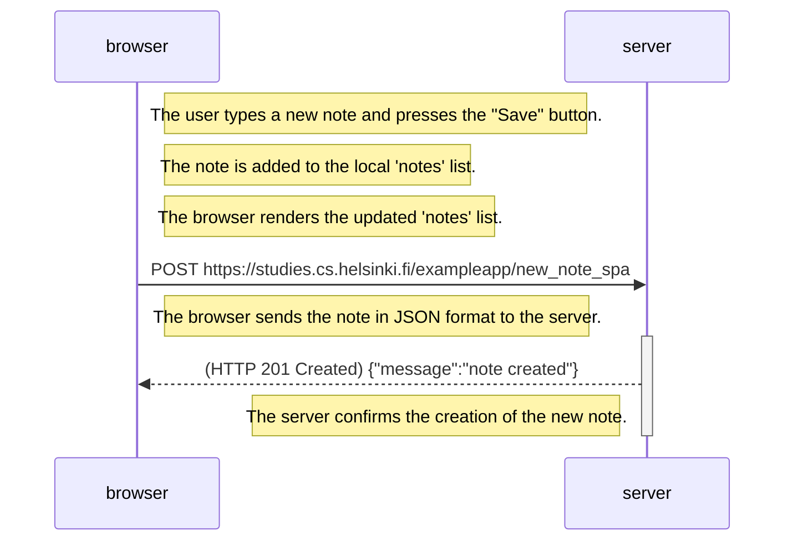

```mermaid
sequenceDiagram
    participant browser
    participant server

    Note right of browser: The user types a new note and presses the "Save" button.
    Note right of browser: The note is added to the local 'notes' list.
    Note right of browser: The browser renders the updated 'notes' list.

    browser->>server: POST https://studies.cs.helsinki.fi/exampleapp/new_note_spa
    Note right of browser: The browser sends the note in JSON format to the server.

    activate server
    server-->>browser: (HTTP 201 Created) {"message":"note created"}
    Note left of server: The server confirms the creation of the new note.
    deactivate server
```